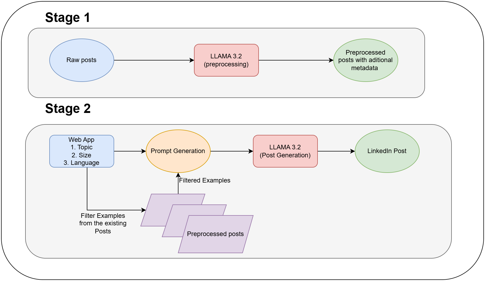

# LinkedIn Post AI

This app will create a LinkedIn post based on your preferences. This uses LLMA3.2 model as LLM for the content generation.
It also can be customized with your own LinkedIn post data.

## Table of Contents

- [About](#about)
- [System Architecture](#system-architecture)
- [Features](#features)
- [Usage](#usage)


## About

When we need an AI app to generate a Linked in Post based on our preferences, This can come in handy by providing our own posts data to generate relevant post based on our writing style.

## System Architecture


## Features

- Streamlit based webapp
- Uses LLAMA 3.2 model generate LinkedIn post which runs on cloud.
- Save your time to create new LinkedIn posts based on your requirements.

## Usage

### Prerequisites

Make sure you have the following installed on your system:
1. To get started we first need to get an API_KEY from here: https://console.groq.com/keys. Inside `.env` update the value of `GROQ_API_KEY` with the API_KEY you created.

2. To get started, first install the dependencies using:
    ```commandline
     pip install -r requirements.txt
     ```

### Step-by-Step Guide

1. Clone the repository:

   ```bash
   git clone https://github.com/Api1998/LinkedIn_Post_AI.git
   ```
2. Run the following to process the raw data (processed posts will be created in app_data folder):
    ```commandline
   python ./pre_process.py
   ```

2. Run the streamlit app:
   ```commandline
   streamlit run ./main.py
   ```
3. Select you preference to generate a LinkedIn post and click generate button


Note: You can modify the data in app_data/raw_posts.json to suit your content needs

Credits:- Codebasics